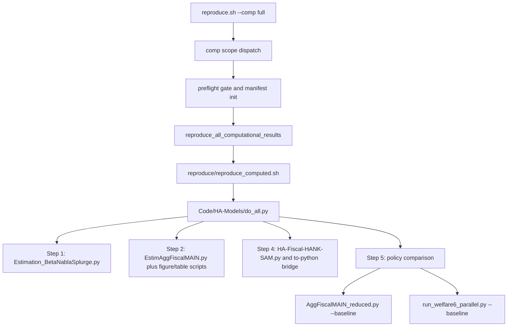

# Codebase Structure and Documentation Critique

**Date:** 2026-04-25
**Status:** Drafted from source inspection; no full reproduction run attempted
**Audit spine:** `./reproduce.sh --comp full`

## 1. Executive Summary

The codebase is impressive as a research artifact: it contains the model, paper, computational pipeline, benchmark machinery, and a growing amount of self-documenting reproduction infrastructure in one repository. But it is not yet organized as a maintainable replication package. The same command that establishes credibility, `./reproduce.sh --comp full`, exposes the main weakness: the paper's principal results depend on a long chain of shell dispatch, implicit working directories, Python scripts with import-time state, stringly typed run dictionaries, scattered output paths, and documentation that has drifted behind the actual production pipeline.

The most important finding is that the repository has multiple overlapping stories about how the paper is reproduced. The actual default full path is:

That is not the story presented consistently across the README family. Some docs still name `AggFiscalMAIN.py`, `CRRA2` output directories, obsolete full-run timings, or a missing `TIMING-ESTIMATES.md` file. The drift matters because future maintainers, replicators, and coauthors will naturally trust the documentation when deciding which outputs are canonical.

The second major finding is that the code has no single contract for configuration, artifact ownership, or output provenance. Parameters come from hard-coded defaults, files containing Python dictionary literals, command-line positional arguments, environment variables, and branch-specific flags. Outputs are written by many scripts into directories whose names (`Baseline`, `CRRA2`, `Reduced_Run`, `Baseline_MC`, `*_parallel`) encode history rather than a documented contract. The new manifest machinery is a step in the right direction, but it currently hashes only default Baseline output roots and does not yet cover the full artifact surface created by `do_all.py`.

The highest-return work is therefore not a rewrite. It is a staged documentation and contract repair: first document the actual DAG and artifact map, then centralize configuration and output ownership, then gradually package the reusable model logic and quarantine exploratory scripts.

## 2. What `--comp full` Actually Exercises

The default full computational path in `reproduce.sh` is selected by the `comp` action and `full` scope. The shell case dispatch rejects incompatible `--tm-only` and `--mc-only` uses, runs the preflight gate, then calls `reproduce_all_computational_results`. That function initializes a run manifest, warns that the computation takes 4-5 days, invokes `./reproduce/reproduce_computed.sh`, records one manifest step named `all`, records default output roots, and finalizes the manifest.

`reproduce/reproduce_computed.sh` is a thin dispatcher. It sources the reproduction environment, changes into `Code/HA-Models`, creates an empty `version` file, exports `HAFISCAL_RUN_STEP_3` with a default of `false`, runs `python do_all.py`, and removes the `reproduce/.results_pregenerated` flag after successful computation.

`Code/HA-Models/do_all.py` is therefore the real default full-run spine. Its default step flags are:

- `HAFISCAL_RUN_STEP_1`: true
- `HAFISCAL_RUN_STEP_2`: true
- `HAFISCAL_RUN_STEP_3`: false
- `HAFISCAL_RUN_STEP_4`: true
- `HAFISCAL_RUN_STEP_5`: true

The resulting default full path runs:

- Step 1: `Target_AggMPCX_LiquWealth/Estimation_BetaNablaSplurge.py`
- Step 2: `FromPandemicCode/EstimAggFiscalMAIN.py`, `CreateLPfig.py`, `CreateIMPCfig.py`, `estimBetas_tabular_generate.py`, `nonTargetedMoments_tabular_generate.py`
- Step 4: `FromPandemicCode/HA-Fiscal-HANK-SAM.py`, `HA-Fiscal-HANK-SAM-to-python.py`
- Step 5a: `FromPandemicCode/AggFiscalMAIN_reduced.py --baseline`
- Step 5b: `FromPandemicCode/run_welfare6_parallel.py --baseline --out-dir welfare6_scenario_results_Baseline_reproduce --table-dir Tables/Baseline`

The `max` computational scope is the same spine with `HAFISCAL_RUN_STEP_3=true`, so it also runs `EstimAggFiscalMAIN.py` with splurge set to zero.

The important variant paths are separate:

- `./reproduce.sh --comp full --tm-only` does not run `do_all.py`; it calls `reproduce/reproduce_computed_tm_only.sh`, sets `HAFISCAL_SIM_METHOD=TM`, and runs `AggFiscalMAIN_reduced.py --baseline`.
- `./reproduce.sh --comp full --mc-only` does not run `do_all.py`; it calls `reproduce/reproduce_computed_mc_only.sh`, sets `HAFISCAL_SIM_METHOD=MC`, and runs `AggFiscalMAIN_reduced.py --baseline`.
- `./reproduce.sh --comp TM-and-MC` does not run `do_all.py`; it calls `reproduce/reproduce_computed_TM_and_MC.sh`, which embeds three phases in shell and inline Python: TM multipliers, MC validation, and serial `run_hybrid_welfare6.py`.

The critique should therefore treat "full reproduction" as a family of workflows, not one entry point. The default workflow is `reproduce.sh -> reproduce_computed.sh -> do_all.py`; the variants are production-relevant but are not substitutes for that full default path.

## 3. Structural Critique

### 3.1 The Reproduction DAG Is Implicit Rather Than Declared

The workflow is encoded procedurally across shell and Python instead of being represented as an explicit DAG. `reproduce.sh` knows about scopes, preflight, manifest creation, and variant dispatch. `reproduce_computed.sh` knows about environment activation and `do_all.py`. `do_all.py` knows about the five paper steps, but calls them via `os.chdir` and `os.system`.

This makes the pipeline hard to inspect without reading code. It also means step metadata is duplicated: timings appear in `reproduce.sh`, `do_all.py`, `Code/README.md`, `README/REPLICATION.md`, and script comments, and these sources disagree.

Recommendation: create one canonical reproduction DAG document and one machine-readable artifact map. Keep the current shell interface, but use the DAG as the maintained contract.

Estimated time: 1-3 days for a markdown DAG and artifact map; 4-7 days if backed by a small JSON/YAML manifest consumed by tests and docs.

### 3.2 `do_all.py` Is Too Important To Be A Thin Research Script

`do_all.py` is the default full-run orchestrator but still has the structure of a research-era script. It changes directories repeatedly and uses string-concatenated `os.system` calls. Most step calls do not check return codes. Step 5 records return codes from `os.system`, but does not fail fast if Step 5a or Step 5b fails; it logs `rc=` and continues to mark the step complete.

The risk is straightforward: a long reproduction can partially fail while the outer driver continues far enough to leave stale or mixed outputs. This is especially risky because results are written into stable paper-facing directories.

Recommendation: refactor `do_all.py` to use `pathlib.Path`, `subprocess.run(..., check=True)`, explicit command lists, and explicit output directories. Preserve behavior first; do not combine this with model changes.

Estimated time: 2-4 days for a behavior-preserving refactor and smoke tests; 1 additional day to wire per-step manifest entries.

### 3.3 Configuration Authority Is Split Across Too Many Mechanisms

Parameter authority is scattered:

- `do_all.py` uses `HAFISCAL_RUN_STEP_*` environment variables to decide which paper steps run.
- `AggFiscalMAIN_reduced.py` uses CLI flags (`--fast-reproduce`, `--solo-rec`, `--dual-mc`, `--smoke-test`, `--baseline`) and environment variables (`HAFISCAL_SIM_METHOD`, `HAFISCAL_TM_A_INDEXED`).
- `Parameters.py` chooses calibration files from `Parametrization` strings, then allows overrides via `HAFISCAL_DISCFAC_FILE`, `HAFISCAL_SPLURGE_FILE`, and `HAFISCAL_SPLURGE_OVERRIDE`.
- `EstimParameters.py` reads `sys.argv` at import time, reads a splurge result file at import time, and has test modes controlled by `HAFISCAL_MC_DETERMINISM_TEST`.

This is workable for a single maintainer who remembers the conventions, but not for a replication package. There is no single precedence rule that says which layer wins when the same concept is set in a parameter file, environment variable, command-line flag, and `Parametrization` string.

Recommendation: define a configuration contract with documented precedence. A conservative first version can be a `docs` page plus a small `RunConfig` dataclass used by new drivers; later versions can migrate old scripts gradually.

Estimated time: 4-8 days for the contract and initial wiring through `do_all.py`, `AggFiscalMAIN_reduced.py`, and `Parameters.py`; 2-4 weeks to remove most legacy entry-point assumptions.

### 3.4 Persisted Inputs Use Python Literals And `eval`

`Parameters.py` reads discount-factor estimates and splurge estimates from text files by calling `eval` on file contents. `EstimParameters.py` also calls `eval` on `Result_AllTarget.txt`. This is both unsafe and opaque: the file format is not documented as a schema, and the loader can execute arbitrary Python if the file is modified.

There is already a better pattern nearby: `reproduce/build_manifest.py` parses the existing `Result_AllTarget.txt` format with `ast.literal_eval`. That should become the minimum standard.

Recommendation: replace `eval` with `ast.literal_eval` immediately, then migrate the result files to JSON or TOML with a version field. Provide compatibility loaders for existing Python-literal files if historical artifacts must remain readable.

Estimated time: 0.5-1 day for `ast.literal_eval` replacement and tests; 2-5 days for a versioned structured format and migration scripts.

### 3.5 The Output Contract Is Scattered And Historically Named

The same conceptual outputs appear under several names and directories. Documentation still mentions `Tables/CRRA2/Multiplier.tex` and `Tables/CRRA2/welfare6.tex`, while the current full Step 5 writes `Tables/Baseline/Multiplier.tex` and `Tables/Baseline/welfare6.tex`. `reproduce_computed_tm_only.sh` runs Baseline but prints `Tables/CRRA2/Multiplier.ltx` and `Figures/CRRA2/`. `run_welfare6_parallel.py` says in its header that it writes to `Tables/{param}_parallel/welfare6.tex`, but `do_all.py` now invokes it with `--table-dir Tables/Baseline`.

The output layer also uses pickled Python objects saved with `.csv` extensions via `OtherFunctions.py`, which makes artifact type unclear and invites misuse by readers expecting CSV text.

Recommendation: create an artifact manifest that maps each paper table/figure to generator, required inputs, output path, file format, and valid reproduction scopes. Rename future binary pickle outputs to `.pkl` or `.pickle`; keep compatibility for existing `.csv` pickle files but document them as binary pickles.

Estimated time: 1-3 days for the manifest and docs; 3-7 days for path ownership cleanup; 1-2 weeks if output filenames and downstream LaTeX inputs are normalized.

### 3.6 The Manifest System Is Promising But Not Yet Complete

`reproduce.sh` now has preflight and manifest wiring. That is good infrastructure. But the default output roots are only:

- `Code/HA-Models/FromPandemicCode/Tables/Baseline`
- `Code/HA-Models/FromPandemicCode/Figures/Baseline`

The default `do_all.py` path also touches `Target_AggMPCX_LiquWealth`, `FromPandemicCode/Results`, `Results_HANK`, and possibly other table and figure directories. The manifest also snapshots a fixed list of `HAFISCAL_*` variables, so newly introduced flags can be silently omitted unless the list is manually maintained.

`reproduce/run-manifests/decisions.md` still says only `reproduce_nano_results` was wired in the first manifest commit, while the current `reproduce.sh` shows wiring for many scopes. That is understandable history, but it increases cognitive load because readers must know which notes are historical and which remain current.

Recommendation: expand manifest output roots by scope, include all `HAFISCAL_*` environment variables dynamically or document the fixed list as deliberate, and move historical decisions into an archive section with a "current status" summary.

Estimated time: 2-4 days for full default-root coverage and current-status docs; 1-2 weeks for per-output provenance markers.

### 3.7 Tests And Diagnostics Are Not Clearly Separated

`FromPandemicCode` mixes core modules, production drivers, smoke tests, validation scripts, diagnostics, historical experiments, and phase scripts. Some pytest-style files mutate `sys.argv` and `os.chdir` at import or module scope. This makes test discovery fragile and makes it hard to know which tests are fast, deterministic, and safe for CI.

The path needs at least three categories:

- Regression tests: fast, deterministic, suitable for `pytest`.
- Validation harnesses: slower checks for TM/MC equality, welfare sensitivity, and reproduction invariants.
- Diagnostics and historical experiments: useful for researchers, not part of routine testing.

Recommendation: create `tests/`, `validation/`, and `experiments/` or equivalent directories. Start by moving only tests whose behavior is already stable, leaving import shims if needed. Add fixtures for `sys.argv`, working directories, and temporary output directories.

Estimated time: 3-7 days for a first cleanup and CI-safe smoke suite; 2-4 weeks for robust coverage of the full reproduction DAG.

### 3.8 HARK Compatibility And Local Model Semantics Need One Architecture Note

The codebase contains important model semantics and HARK compatibility assumptions: hierarchical Markov state encoding, `AggFiscalType` construction with `construct=False`, HARK 0.17 differences, RNG synchronization, TM neutral-measure logic, and splurge interpretation changes. These are scattered across `CLAUDE.md`, Cursor rules, script comments, history notes, and code.

This is too important to remain distributed. Future maintainers need one architecture note explaining:

- the class hierarchy and where HAFiscal extends HARK;
- the combined Markov state convention;
- the distinction between MC and TM outputs;
- which outputs are valid under TM only, MC only, or both;
- current interpretation of splurge and where it affects estimation, simulation, and welfare.

Recommendation: write `docs/architecture.md` or `README/ARCHITECTURE.md` and link it from `README.md`, `Code/README.md`, and `CLAUDE.md`.

Estimated time: 1-3 days for a first maintainer-grade note; 1 additional week if every claim is backed by tests or formal derivations.

## 4. Documentation Critique

### 4.1 Broken Or Misleading Links

`README.md` points readers to `reproduce/benchmarks/TIMING-ESTIMATES.md`, but that file is not present. The actual benchmark documentation appears to be under `reproduce/benchmarks/README.md`, `BENCHMARKING_GUIDE.md`, `SUMMARY.md`, and benchmark result files.

`reproduce/README.md` links to `../README-QE.md`, which is not present in this tree. If that file belongs to a generated public or QE repository, the link should say so; otherwise it should be removed.

`README/QUICK-REFERENCE.md` still contains template placeholders `{{REPO_URL}}` and `{{REPO_NAME}}` in one-line installation commands.

Recommendation: add a link checker to the lightweight validation suite and repair the broken links or document external-only links.

Estimated time: 0.5-1 day.

### 4.2 Timings Disagree Across Docs And Code

The root README and `README/REPLICATION.md` state that `--comp full` takes 4-5 days. `reproduce.sh` also warns 4-5 days for the default full path. But `reproduce/README.md` says a full publication reproduction uses `../reproduce.sh --comp full` in about 2-3 hours and `--comp max` in about 4-6 hours. `Code/README.md` contains still another timing story, including Step 5 at 65 hours, while `do_all.py` currently expects Step 5a around 9 hours and Step 5b around 1 hour.

Some of this may reflect real improvement from TM and parallel welfare work, but the documentation does not explain the difference between cold full estimation, partial runs using committed outputs, TM-only runs, MC-only runs, and minimal runs that require existing objects.

Recommendation: maintain one timing table with scope, prerequisites, command, expected outputs, and cold/hot assumptions. Link every README to that table instead of repeating numbers.

Estimated time: 0.5-1 day for the table; 1-2 days if benchmark JSON is mined to populate it.

### 4.3 The Documented Step 5 Is Stale

`Code/README.md` still identifies Step 5 as `FromPandemicCode/AggFiscalMAIN.py` with `CRRA2` output directories. The actual default `do_all.py` Step 5 uses `AggFiscalMAIN_reduced.py --baseline` and `run_welfare6_parallel.py --baseline`, writing to `Tables/Baseline`.

`do_all.py` itself contains stale comments saying Step 5b is `run_hybrid_welfare6.py --baseline` and that the parallel driver writes separately to `Tables/Baseline_parallel/`, while the actual invocation uses `run_welfare6_parallel.py` and writes into `Tables/Baseline`.

Recommendation: update Step 5 docs and comments together, with a short explanation of why the production path is now two-phase TM multipliers plus parallel MC welfare.

Estimated time: 0.5-1 day.

### 4.4 Variant Pipelines Are Not First-Class In The Main Docs

`--tm-only`, `--mc-only`, and `TM-and-MC` are documented in shell help and script comments, but not integrated into the main README path as distinct reproduction modes with distinct validity. This is risky because TM is exact for some aggregate outputs but invalid for per-agent welfare tables, while MC is required for other outputs.

Recommendation: add a "Reproduction Modes And Valid Outputs" section to `README/REPLICATION.md` and `Code/README.md`.

Estimated time: 1-2 days.

### 4.5 Public-Facing Docs Do Not Clearly Separate User, Replicator, Maintainer, And Agent Audiences

The README family tries to serve several audiences at once: casual readers, replicators, maintainers, QE handoff, dashboard users, and AI agents. The result is duplicated and partially stale guidance. `CLAUDE.md` and Cursor rules contain some of the most current architecture knowledge, but those are not normal user-facing docs.

Recommendation: define four entry points and keep each short:

- user: how to view paper/dashboard and compile docs;
- replicator: how to reproduce paper outputs;
- maintainer: how the pipeline is structured and how to modify it safely;
- agent: coding gotchas and current architectural rules.

Estimated time: 2-4 days to reorganize existing material without rewriting everything.

## 5. Recommendation Backlog

### Immediate Repairs (0.5-3 Days Each)

1. Repair broken docs links and placeholders.
   - Files: `README.md`, `README/QUICK-REFERENCE.md`, `reproduce/README.md`.
   - Validation: run a link checker or a small script over markdown links.
   - Estimate: 0.5-1 day.

2. Update Step 5 documentation and comments.
   - Files: `Code/README.md`, `Code/HA-Models/do_all.py`, `reproduce/README.md`.
   - Validation: compare documented commands against `do_all.py` and shell help.
   - Estimate: 0.5-1 day.

3. Replace `eval` with safe literal parsing.
   - Files: `Parameters.py`, `EstimParameters.py`, any sibling loaders found by search.
   - Validation: unit test existing `Result_AllTarget.txt` and `DiscFacEstim_*.txt` parsing.
   - Estimate: 0.5-1 day.

4. Write the actual reproduction DAG and mode-validity matrix.
   - Files: new or updated `README/REPLICATION.md` section, possibly `README/provenance.md`.
   - Validation: every command in the DAG points to an existing script.
   - Estimate: 1-2 days.

5. Fix stale output messages in TM-only and parallel welfare scripts.
   - Files: `reproduce/reproduce_computed_tm_only.sh`, `run_welfare6_parallel.py`.
   - Validation: help text and post-run echo paths match actual output arguments.
   - Estimate: 0.5 day.

### Medium Refactors (2-10 Days Each)

6. Refactor `do_all.py` into a checked subprocess orchestrator.
   - Files: `Code/HA-Models/do_all.py`.
   - Validation: smoke each step with safe flags where possible; verify failure propagation.
   - Estimate: 2-4 days.

7. Create the artifact manifest.
   - Files: new `README/artifacts.md` or `reproduce/artifacts.yaml`; link from README and provenance docs.
   - Validation: every main paper figure/table maps to a generator and output file.
   - Estimate: 1-3 days for markdown; 3-7 days if machine-readable and tested.

8. Expand run manifest coverage.
   - Files: `reproduce.sh`, `reproduce/build_manifest.py`.
   - Validation: nano or smoke run records expected roots; no missing paper-facing outputs for full scope.
   - Estimate: 2-4 days.

9. Define and document the configuration contract.
   - Files: `Parameters.py`, `EstimParameters.py`, `AggFiscalMAIN_reduced.py`, docs.
   - Validation: tests for precedence among defaults, files, env vars, and CLI flags.
   - Estimate: 4-8 days.

10. Separate tests from diagnostics.
    - Files: `Code/HA-Models/FromPandemicCode/test_*.py`, `diag_*`, `validate_*`, `phase*`.
    - Validation: `pytest` collects only intended tests and completes a smoke subset.
    - Estimate: 3-7 days for first pass.

### Larger Modernization (1-4 Weeks Each)

11. Promote reusable model code into an importable package.
    - Scope: model classes, parameter builders, simulation routines, output writers.
    - Validation: entry points run via `python -m`, tests import modules without `cwd` changes.
    - Estimate: 2-4 weeks.

12. Centralize output ownership and provenance markers.
    - Scope: output path registry, manifest integration, per-output metadata.
    - Validation: each generated table/figure has recorded generator, inputs, command, and hash.
    - Estimate: 1-2 weeks for metadata; 2-3 weeks if file naming is normalized.

13. Build a robust reproduction regression suite.
    - Scope: smoke, nano, TM-only, MC deterministic, artifact-presence tests, docs checks.
    - Validation: CI or local command runs a documented fast suite after edits.
    - Estimate: 2-4 weeks.

14. Clarify repository audience boundaries.
    - Scope: user docs, replicator docs, maintainer architecture, agent rules.
    - Validation: first-time-user path is short; maintainer path contains enough architecture to modify code safely.
    - Estimate: 1-2 weeks if done alongside docs cleanup.

## 6. Suggested Roadmap

Phase 1 should be documentation and safety only. Repair broken links, stale Step 5 docs, missing timing files, and unsafe `eval`. Add the reproduction DAG and output validity matrix. This is behavior-preserving and should take about 3-6 working days.

Phase 2 should make the current pipeline harder to misuse. Refactor `do_all.py` to checked subprocess calls, expand manifest coverage, and create a real artifact manifest. This should take about 1-2 weeks, depending on how much validation is required.

Phase 3 should reduce structural debt. Define the configuration contract, split tests from diagnostics, and document the HARK boundary. This should take about 2-4 weeks.

Phase 4 is packaging and provenance maturity. Move reusable logic into a package, make output ownership explicit, and turn the reproduction graph into tested infrastructure. This is a multi-week effort and should be staged around paper deadlines.

## 7. Residual Risks And Open Questions

- Some documentation drift may be intentional history rather than current guidance. The fix is to label historical notes explicitly rather than delete them blindly.
- Full numerical validation is out of scope for this critique because `./reproduce.sh --comp full` is a multi-day run. The critique relies on static inspection, lightweight validation, and existing comments.
- Output paths are politically sensitive because paper, public, and QE repositories may depend on them. Path cleanup should preserve current aliases until downstream LaTeX and release scripts are audited.
- The recent manifest and preflight system is moving quickly. Before implementing recommendations, re-check `reproduce.sh` and `reproduce/run-manifests/decisions.md` for newer wiring.

## 8. Bottom Line

The codebase can reproduce the paper, but the structure makes it harder than necessary to understand why a result appears where it does, which path generated it, and which assumptions controlled it. The best near-term improvement is not a wholesale refactor. It is to make the actual `--comp full` graph, artifact ownership, configuration precedence, and output validity explicit. Once those contracts exist, deeper refactors can be behavior-preserving rather than archaeological.
