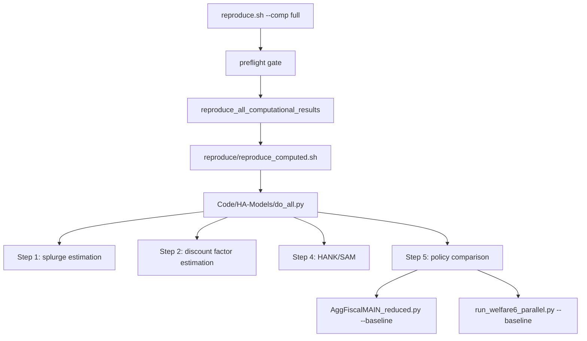

# Plan: documentation-only cleanup of reproduction and codebase guidance

**Date:** 2026-04-25
**Status:** Planned
**Scope:** Documentation and comments only; no behavioral code changes
**Predecessor:** `plans/20260425-1252h_reproduce-full-codebase-critique.md`

## 1. Goal

Make the documentation accurately describe the current HAFiscal reproduction workflow, especially the path exercised by:

```bash
./reproduce.sh --comp full
```

This plan is intentionally limited to documentation repair. It should fix errors, stale paths, stale timings, missing or broken links, and unclear audience guidance. It should not refactor Python or shell behavior, change output paths, change numerical logic, or alter the reproduction pipeline.

The main success criterion is that a new replicator or maintainer can read the README path and correctly understand what the current commands run, which outputs they produce, which modes are variants, and which material is historical.

## 2. Non-goals

- Do not change model code or computational behavior.
- Do not change generated numerical results.
- Do not rename output directories or move source files.
- Do not replace `eval`, refactor `do_all.py`, modify manifest behavior, or reorganize tests. Those belong in the follow-on functional-improvements plan.
- Do not attempt to run `./reproduce.sh --comp full`.

Documentation comments inside source files may be edited only when the edit is purely explanatory and does not affect execution.

## 3. Documentation Surfaces To Update

Review and update these files first:

- `README.md`
- `README/GETTING-STARTED.md`
- `README/REPLICATION.md`
- `README/provenance.md`
- `README/QUICK-REFERENCE.md`
- `README/INSTALLATION.md` if setup guidance conflicts with current `uv` behavior
- `Code/README.md`
- `reproduce/README.md`
- `reproduce/benchmarks/README.md`
- `reproduce/benchmarks/BENCHMARKING_GUIDE.md`
- `reproduce/run-manifests/decisions.md`
- Documentation comments in `Code/HA-Models/do_all.py`
- Documentation comments in `reproduce/reproduce_computed_tm_only.sh`
- Documentation comments in `Code/HA-Models/FromPandemicCode/run_welfare6_parallel.py`

## 4. Correct Reproduction Story To Document

The default full computational path is:



Document these facts consistently:

- Default `--comp full` runs `reproduce/reproduce_computed.sh`, which runs `Code/HA-Models/do_all.py`.
- Default `do_all.py` runs Steps 1, 2, 4, and 5. Step 3 is off by default.
- `--comp max` uses the same spine but enables Step 3 through `HAFISCAL_RUN_STEP_3=true`.
- Step 5 currently runs `AggFiscalMAIN_reduced.py --baseline` for TM multipliers and `run_welfare6_parallel.py --baseline` for MC welfare-6.
- `--comp full --tm-only` and `--comp full --mc-only` do not run `do_all.py`; they directly dispatch to their corresponding shell scripts and then to `AggFiscalMAIN_reduced.py --baseline`.
- `--comp TM-and-MC` is a separate three-phase workflow and should not be described as identical to default `--comp full`.

## 5. Specific Repairs

### 5.1 Broken and stale links

- Replace or remove the root README link to `reproduce/benchmarks/TIMING-ESTIMATES.md`, which is not present.
- Replace or qualify the `reproduce/README.md` link to `../README-QE.md`, which is not present in this tree.
- Replace template placeholders `{{REPO_URL}}` and `{{REPO_NAME}}` in `README/QUICK-REFERENCE.md`.
- Check internal links to `README/REPLICATION.md#6-results-mapping`; if the detailed mapping lives in `README/provenance.md`, make the root README say that directly.

Estimate: 0.5-1 day.

### 5.2 Timing consistency

Create one authoritative timing table and make other docs link to it rather than repeating conflicting estimates.

The table should distinguish:

- `--docs`
- `--data`
- `--comp min`
- `--comp full`
- `--comp max`
- `--comp full --tm-only`
- `--comp full --mc-only`
- `--comp TM-and-MC`

Each row should state:

- command;
- prerequisites;
- expected cold-run duration;
- expected hot or partial-run duration, if meaningful;
- main outputs;
- whether it is a paper-complete path or a validation/variant path.

Remove or explain the stale `reproduce/README.md` statement that publication `--comp full` takes about 2-3 hours and `--comp max` about 4-6 hours.

Estimate: 0.5-1 day for a manually maintained table; 1-2 days if existing benchmark JSON is summarized.

### 5.3 Step 5 documentation

Update `Code/README.md` and relevant comments in `do_all.py` so they no longer identify Step 5 as `AggFiscalMAIN.py` writing to `Tables/CRRA2`.

The corrected documentation should say:

- Step 5a: `AggFiscalMAIN_reduced.py --baseline`, TM multipliers and paper-facing aggregate outputs.
- Step 5b: `run_welfare6_parallel.py --baseline`, MC welfare-6, writing to `Tables/Baseline`.
- `run_hybrid_welfare6.py` remains relevant for the separate `TM-and-MC` path or historical comparison, but is not the default full-run Step 5b in `do_all.py`.

Estimate: 0.5-1 day.

### 5.4 Reproduction mode validity matrix

Add a concise matrix to `README/REPLICATION.md` or `Code/README.md` explaining which modes are valid for which classes of output.

At minimum, distinguish:

- aggregate multipliers and IRFs;
- per-agent welfare tables;
- Lorenz or wealth-distribution outputs;
- HANK/SAM outputs;
- robustness with splurge set to zero.

The matrix should make clear that TM-only output is valid for the TM-supported aggregate subset but not for per-agent welfare outputs.

Estimate: 1-2 days.

### 5.5 Artifact map in documentation

Create or update a markdown artifact map that links paper-facing outputs to generator scripts.

For each principal paper figure/table, include:

- paper label or table/figure number;
- generated file path;
- generator script or function;
- required reproduction step;
- valid reproduction modes;
- notes about committed/pre-generated inputs if applicable.

This can be a markdown file first. A machine-readable artifact registry belongs in the functional-improvements plan.

Estimate: 1-3 days.

### 5.6 Audience split

Restructure the documentation entry path so the main README clearly routes readers by audience:

- casual reader: view paper/dashboard and compile existing docs;
- replicator: reproduce data, computation, and paper outputs;
- maintainer: understand the pipeline and modify it safely;
- agent/contributor: project-specific code rules and gotchas.

Do not rewrite everything. Add a short map and remove duplicative stale material where possible.

Estimate: 1-3 days.

### 5.7 Historical notes and manifest decisions

Update `reproduce/run-manifests/decisions.md` so it is clear which entries are historical implementation notes and what the current state is.

In particular, avoid leaving readers with the impression that only `reproduce_nano_results` is currently manifest-wired if `reproduce.sh` now wires additional scopes.

Estimate: 0.5-1 day.

## 6. Validation

Use lightweight validation only:

- Verify all referenced files exist.
- Run a markdown link check if available.
- Run `./reproduce.sh --help` only if needed to confirm documented command names.
- Do not run `./reproduce.sh --comp full`.
- Use `ReadLints` on edited markdown and comment-only source files.

## 7. Deliverables

- Updated README path with no broken local links for the audited files.
- One authoritative reproduction-mode and timing table.
- Correct Step 5 documentation.
- A documentation-only artifact map.
- A clear statement of default full, max, tm-only, mc-only, and TM-and-MC workflow differences.

## 8. Estimated Total Effort

Minimum useful pass: 2-3 days.

Thorough documentation cleanup with artifact map and mode-validity matrix: 4-7 days.

This work should be completed before functional refactors so later code changes can be measured against an accurate documented contract.
